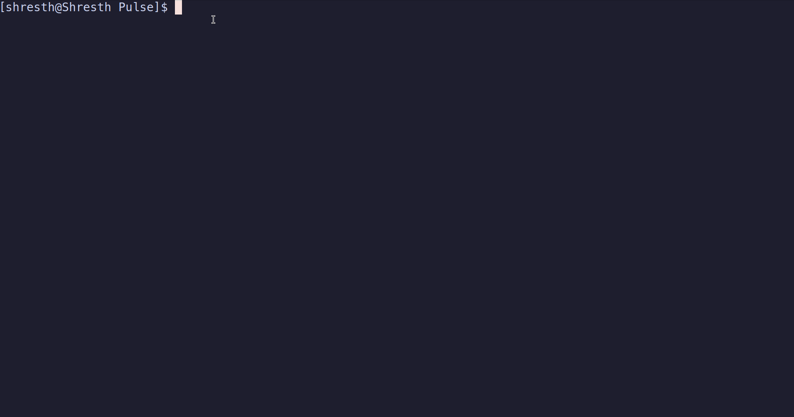

# Pulse

[](https://github.com/you/pulse)  
[](LICENSE)

**A lightweight, responsive terminal-based Linux resource monitor written in C with ncurses.**

## 🚀 Overview

Pulse reads directly from `/proc` to display real‑time CPU, memory, and process statistics in a smooth, multi‑threaded TUI. Designed for minimal overhead and maximum clarity.

<p align="center">
  
</p>

## 🔍 Features

- **Real‑Time Metrics**  
  Instant CPU & memory stats (per‑core and aggregate).  
- **Interactive Process List**  
  Scrollable table; sort by CPU (`c`) or PID (`p`).  
- **Human‑Readable Units**  
  Automatic K/M/G/T suffixes for memory values.  
- **Multi‑Threaded UI**  
  Producer‑consumer model keeps UI at ~30 FPS under load.  
- **Adaptive Layout**  
  Auto‑wraps to any terminal size and CPU count.  

## 🎯 Motivation

Moving beyond “hello world,” Pulse is a deep dive into:

- **Linux Internals**  
  Parsing `/proc/*` for raw system data.  
- **Systems Programming in C**  
  Manual memory management, file I/O, pointers.  
- **Terminal UI Design**  
  ncurses windowing, color pairs, input handling.  
- **Concurrency**  
  pthreads + mutexes to decouple data collection from rendering.  
- **Performance Tuning**  
  Optimized from O(n²) matching to O(n log n) sorting.

## 🏗️ Architecture

```
┌───────────┐      ┌───────────────────┐
│ UI Thread │⇆mutex│ Shared Data Store │
│ (30 FPS)  │      └───────────────────┘
│ • Draw UI │
│ • Handle  │
│   Input   │
└───────────┘
      ▲
      │ copy-on-lock
      ▼
┌───────────────────────────┐
│ Data Thread (1 Hz)        │
│ • Read /proc stats        │
│ • Compute deltas & sort   │
│ • Update shared data      │
└───────────────────────────┘
```

## ⚙️ Requirements

- `GCC` (or compatible C compiler)  
- `make`  
- `ncurses` development headers  
- `pthreads` (usually bundled)


## 🛠️ Build & Run

```bash
git clone https://github.com/you/pulse.git  
cd pulse
sudo pacman -S ncurses
make all
make run

``` 

## ⌨️ Controls

| Key / Input | Action                          |
|-------------|----------------------------------|
| `q`         | Quit the application             |
| `c`         | Sort processes by CPU usage ↓    |
| `p`         | Sort processes by Process ID ↑   |
| ↑ / ↓       | Scroll the process list          |
| Mouse Wheel | Scroll the process list          |


## 🧩 Development Journey

1. **Version 1: Data Engine**  
   - Parsed `/proc/[pid]/stat`  
   - Fixed pointer arithmetic and memory leaks with Valgrind  
2. **Version 2: ncurses UI**  
   - Built dynamic panels and handled `KEY_RESIZE`  
   - Resolved stack‑smashing from fixed‑size buffers  
3. **Version 3: Performance Refactor**  
   - Introduced producer‑consumer threading  
   - Swapped O(n²) matching for `qsort`/`bsearch` (O(n log n))  
   - Eliminated redundant allocations for steady 30 FPS


## 📈 Roadmap

- [ ] `k` key to kill selected process  
- [ ] Implement a `/`-based fuzzy search to filter the process list by name or PID. 
- [ ] Network & disk I/O panels  
- [ ] Load user preferences (e.g., color themes, refresh interval) via a `.pulse.conf` file.
- [ ] Add Email Alerts via SMTP


## 📄 License

This project is licensed under the MIT License. See [LICENSE](LICENSE) for details.
